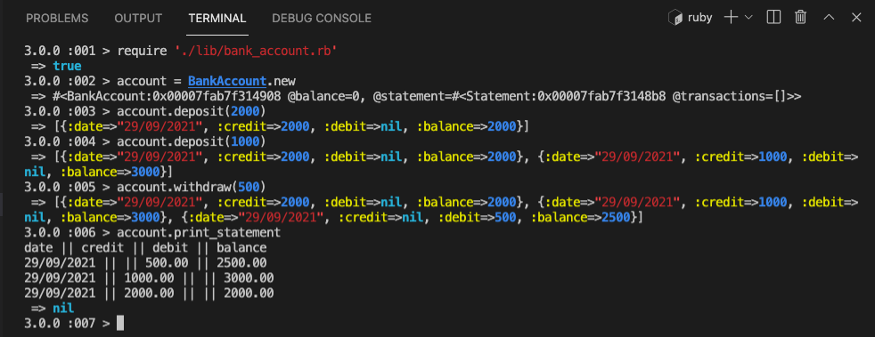
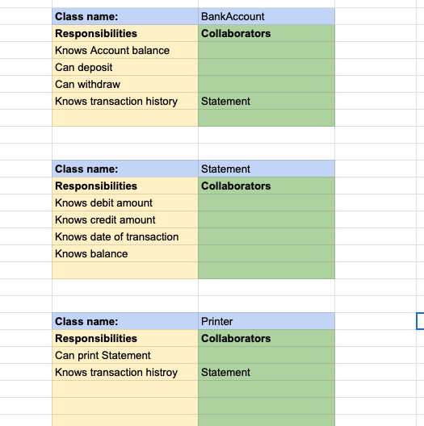

# Bank Tech Test - ruby
This is a project to practice my OO design and TDD skills while maintaining good code quality.

This project allows one to create an account, deposit money into the account, withdraw from the account and also print statements.


### How to Interact as a User
- Clone this repo.
- Install dependencies with:

   ```shell
   bundle
   ```

- Run test suites with:

   ```shell
   rspec && rubocop
   ```

- Launch IRB:

   ```shell
   irb
   ```

  In IRB.

   ```irb
   require './lib/account.rb'
   account = BankAccount.new
   ```

- Use your account with the following methods and any amount you fancy
 `account.deposit(2000)`  
 `account.withdraw(1000)` 
 `account.print_statement` 

## Final Look 
Here is what it looks like on IRB 


## Specification

### Requirements

* You should be able to interact with your code via a REPL like IRB or the JavaScript console.  (You don't need to implement a command line interface that takes input from STDIN.)
* Deposits, withdrawal.
* Account statement (date, amount, balance) printing.
* Data can be kept in memory (it doesn't need to be stored to a database or anything).

### Acceptance criteria

**Given** a client makes a deposit of 1000 on 10-01-2023  
**And** a deposit of 2000 on 13-01-2023  
**And** a withdrawal of 500 on 14-01-2023  
**When** she prints her bank statement  
**Then** she would see

```
date || credit || debit || balance
14/01/2023 || || 500.00 || 2500.00
13/01/2023 || 2000.00 || || 3000.00
10/01/2023 || 1000.00 || || 1000.00
```

### User Stories 

```
As a Bank Account Manager 
So that each customer starts with a new account
I want every bank account to start with a balance of 0
```

```
As a Customer 
So that I can save my money
I want to be able to deposit funds to my bank account
```

```
As a Customer 
So that I have access to my funds
I want to be able to withdraw from my bank account
```

```
As a Bank Account Manager
So that I have we dont over pay a customer
I want withdrawals from any bank accounts to only be successful when account has sufficent balance
```
```
As a Customer 
So that I know my transactions
I want to be able to print my bank account statements
```

```
As a Customer 
So that I can remember the dates of my transactions
I want to be able to see dates on my bank account statements
```

```
As a Customer 
So that I can how much I deposited
I want a deposit on my statment to reflect the credit amount
```

```

As a Customer 
So that I can know how much I withdrew
I want a withdrawal on my statment to reflect the debit amount
```

```
As a Customer 
So that I know my account balance at each time
I want to see the balance amount on my statment after any transaction is done
```

```
As a Customer 
So that I keep track of my recent transactions
I want to my statement transations to be presented from the earliest to the oldest
```

### Domain Modelling

CRC modelling:



