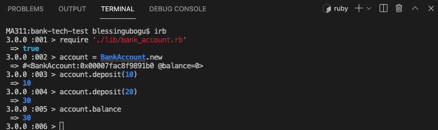

# Bank Tech Test - ruby
This is a project to practice my OO design and TDD skills while maintaining good code quality.

This project allows one to create an account, deposit money into the account, withdraw from the account and also print statements.

## Specification

### Requirements

* You should be able to interact with your code via a REPL like IRB or the JavaScript console.  (You don't need to implement a command line interface that takes input from STDIN.)
* Deposits, withdrawal.
* Account statement (date, amount, balance) printing.
* Data can be kept in memory (it doesn't need to be stored to a database or anything).

### Acceptance criteria

**Given** a client makes a deposit of 1000 on 10-01-2023  
**And** a deposit of 2000 on 13-01-2023  
**And** a withdrawal of 500 on 14-01-2023  
**When** she prints her bank statement  
**Then** she would see

```
date || credit || debit || balance
14/01/2023 || || 500.00 || 2500.00
13/01/2023 || 2000.00 || || 3000.00
10/01/2023 || 1000.00 || || 1000.00
```

### User Stories 

```
As a Bank Account Manager 
So that each customer starts with a new account
I want every bank account to start with a balance of 0
```

```
As a Customer 
So that I can save my money
I want to be able to deposit funds to my bank account
```

```
As a Customer 
So that I have access to my funds
I want to be able to withdraw from my bank account
```

```
As a Bank Account Manager
So that I have we dont over pay a customer
I want withdrawals from any bank accounts to only be successful when account has sufficent balance
```
```
As a Customer 
So that I know my transactions
I want to be able to print my bank account statements
```

```
As a Customer 
So that I can remember the dates of my transactions
I want to be able to see dates on my bank account statements
```

```
As a Customer 
So that I can how much I deposited
I want to a deposit on my statment to reflect the credit amount
```

```

As a Customer 
So that I can know how much I withdrew
I want to a withdrawal on my statment to reflect the debit amount
```

```
As a Customer 
So that I know my account balance at each time
I want to see the balance amount on my statment after any transaction is done
```

```
As a Customer 
So that I keep track of my recent transactions
I want to my statement transations to be presented from the earliest to the oldest
```

### My Setup and Process
- created a README.md file
- started the crc cards on google sheet, will import it later
- created the user storis from the crc cards, hopefully, i covered the required edge cases
- saved and commited
- initiated rspec with `rspec --init`, two files were created .rspec and spec folder.
- I initiated the gemfile with `bundle init` 
- I ran bundle and also tested the rspec was working which came back with a green.
- I created a new file for my firs test
- I wrote my first test for opening account balance is 0 and rspec hasnt detected my test yet. will debug it now to see why i have not got a red for the example test written.
- yay i finally got the tiny bug, I named my test file wrongly used `bank_account.spec.rb` instead of `bank_account_spec.rb` so hurray i got my first R
- Now after a Red, I created the class `BankAccount` with an attribute-reader balance and set it equal to 0, my first test is passing, Green.
- I wrote another test using a one-liner to test the deposit method, failed then created the method deposit with 1 argument(amount), now test passed.
- I wrote a new test to check that the balance increases by the amount, failed test then i hardcoded it to get a green. Now removed the hardcoded part and refactored!

- Now tested for the withdraw method, hardcoded the deduction.
- The problem now as seen from irb is customers can withdraw the money they dont have, goodness! looks like the bank will soon run bankrupt, we need to fix it.
- Written a failing test to raise error when balance is less than the amount to be withdrawn, also fix the gemfile so I can check for coverage and also did some rubocop setup cos it wasnt working well before now.
- I had an error message, Runtime error after writing out the code for the insufficent funds test, I was stuck with it for over 30 minutes, debugging the error, i successfully just copied the error message in the test and pasted it on the code, i guess i must have missed a space or so. but yay a green test now.
-